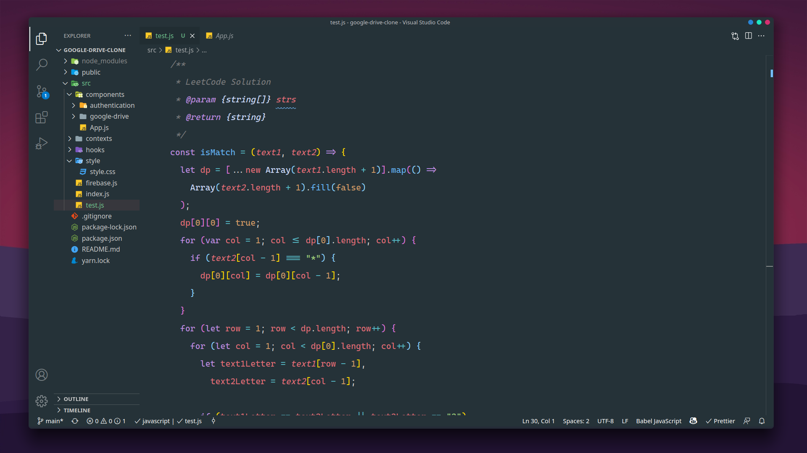

<div align="center">


</div>

<p align="center">
    
</p>

# Tomorrow Theme


 


## Installation

1.  Open  **Extensions** sidebar panel in VS Code.  `View → Extensions`
2.  Search for  `Tomorrow`  - find the one by  **Suhail Kakar**
3.  Click  **Install**  to install it.
4.  Code > Preferences > Color Theme >  **Tomorrow**

## Recommended Settings
```json
{
  "editor.fontSize": 17,
  "editor.fontWeight": "500",
  "editor.fontLigatures": true,
  "editor.lineHeight": 35,
  "editor.tabSize": 2,
  "editor.lineNumbers": "off",
  "editor.renderIndentGuides": false,
  "editor.renderWhitespace": "none",
  "editor.renderControlCharacters": false,
  "editor.minimap.enabled": false,
  "workbench.colorTheme": "Tomorrow Theme",
  "tabnine.experimentalAutoImports": true,

  "editor.smoothScrolling": true,
  "editor.mouseWheelScrollSensitivity": 2,
  "editor.scrollBeyondLastLine": true,
  "editor.cursorStyle": "block",
  "editor.cursorBlinking": "phase",
  "editor.cursorSmoothCaretAnimation": true,
  "editor.cursorWidth": 2,

  "explorer.openEditors.visible": 0,
  "explorer.confirmDelete": false,
  "explorer.decorations.badges": false,
  "problems.decorations.enabled": false,
  "workbench.sideBar.location": "left",

  "window.zoomLevel": 1,
  "window.menuBarVisibility": "toggle",
  "workbench.statusBar.visible": true,
  "workbench.activityBar.visible": true,

  "terminal.integrated.cursorStyle": "block",
  "terminal.integrated.cursorBlinking": true,
  "terminal.integrated.fontWeight": "500",
  "code-runner.runInTerminal": true,

  "editor.formatOnSave": true,
  "workbench.startupEditor": "none",
  "editor.detectIndentation": true,
  "editor.insertSpaces": false,
  "terminal.integrated.rendererType": "dom",
  "window.compositionAttribute": "acrylic",
  "editor.fontFamily": "'Cascadia Code', 'monospace', monospace, 'Droid Sans Fallback'",
  
}
```
